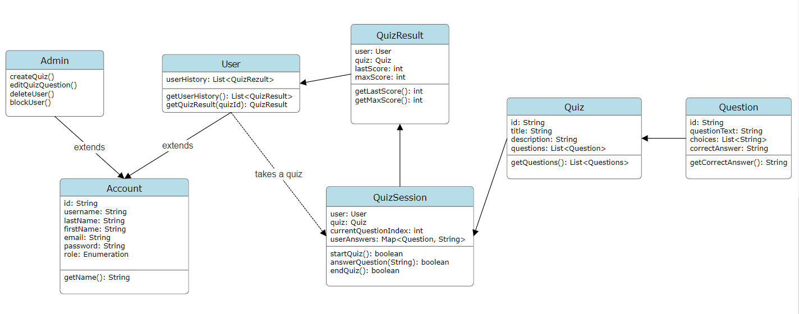
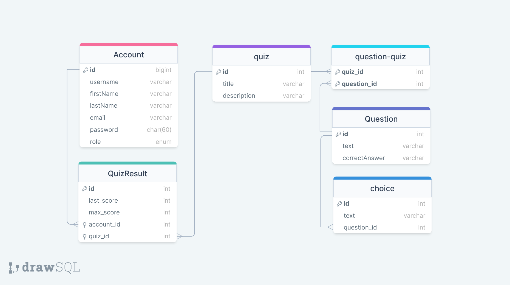

<a name="readme-top"></a>

# Online Quiz System

## Getting Started

### The easy way

This project is hosted on GitHub Pages, and you can view it live by visiting:<br>
https://candea-marian.github.io/Online-Quiz-System

### Clone the Repository way

#### Prerequisites
Before you begin, make sure you have git installed on your machine:

- [Git](https://git-scm.com/)
- A web browser (e.g., Chrome, Firefox, Safari)

#### How to clone it
Open your terminal or command prompt and run the following command to clone the repository to your local machine:

```bash
git clone https://github.com/Candea-Marian/Online-Quiz-System.git
```
#### Navigate to the Project Directory
Change into the project directory:
```bash
cd Online-Quiz-System
```
#### Open the Web Page Locally
Open the index.html file in your preferred web browser. You can do this by double-clicking the file or using the following command:
```bash
open index.html  # for macOS
```
```bash
start index.html  # for Windows
```

## Problem Statement

This project involves creating a web-based quiz application that covers various topics such as Science, History, and Math. The application should dynamically generate questions, present them to the user, and calculate their score based on correct answers. The key requirements include question generation, a user-friendly quiz interface, a scoring system, and an algorithm to handle question randomization.

## Logical Design

I have devised a straightforward plan for organizing the questions, structure, and user progress using the given tech stack. Despite being more accustomed to an object-oriented programming (OOP) approach, I chose a functional programming approach for simplicity.

### Logical System Outline

1. **File Structure and Page Design:**
   After establishing the file structure and designing the pages using HTML and CSS with Bootstrap, I developed a quiz session flow based on multiple functions.

2. **Quiz Session Flow:**
   - Upon pressing the "Start Quiz" button, the quiz page becomes visible.
   - Once the Document Object Model (DOM) of the page is fully loaded, the script initiates the shuffle function, rearranging the order of the questions. The rationale behind this is to simplify the process by ensuring that the question array is shuffled before display, preventing repeated questions and reducing complexity.

3. **Question Rendering:**
   - After shuffling the array, the script renders the first question, presenting multiple-choice options as a group of radio buttons.
   - The render function populates the main element with the question title and calls another function to create the radio buttons.
   - The same function responsible for creating and populating the buttons also establishes an event listener for each button. This listener, in turn, submits the answer directly when a button is clicked.

4. **Answer Submission:**
   - The event listener of the button class invokes a submit function that checks the user's answer.
   - If the answer is correct, the score is increased and stored for future reference.
   - Subsequently, another function is called to either change the question or, if applicable, conclude the quiz and display the results.

   <p align="right">(<a href="#readme-top">back to top</a>)</p>

## Algorithm Implementation (Partial Code)

### Question Randomization
The code begins by importing a set of science questions from an external file, and it initializes variables for tracking the current question index, user score, and user answers.

#### Durstenfeld Shuffle Algorithm
The shuffleArray function implements the Durstenfeld shuffle algorithm to randomize the order of the questions. This algorithm efficiently shuffles the elements of an array in place.

```javascript
// randomize array using Durstenfeld shuffle algorithm
function shuffleArray(array) {
  for (var i = array.length - 1; i > 0; i--) {
    var j = Math.floor(Math.random() * (i + 1));
    var temp = array[i];
    array[i] = array[j];
    array[j] = temp;
  }
}
```
#### User Interface Functions
The code then defines functions for populating choice buttons, rendering questions, submitting answers, and transitioning to the next step.

**populateChoiceButtons** Function
This function dynamically creates radio buttons for each answer choice and associates them with a question. It clears previous choices and adds event listeners for user interaction.

**renderQuestion** Function
This function updates the HTML elements to display the current question and its choices. It calls populateChoiceButtons to handle the creation of choice buttons.

**submitAnswer** Function
This function compares the selected answer with the correct answer, updates the user's score, and records the user's answer. It then calls goToTheNextStep to proceed to the next question.

**goToTheNextStep** Function
This function determines whether to move to the next question or finish the quiz. If there are more questions, it updates the question index and renders the next question; otherwise, it clears the main block and displays the results.

**clearTheMainElement** Function
This function removes the question and choices blocks from the HTML, making space for the score and answer table.

#### Result Display Functions
The code provides functions for displaying the quiz results in a table format.

**populateResultTable** Function
This function creates a table with headers ("Question," "Correct Answer," "Your Answer") and populates the table body with user answers. It colors the user's answer cell based on correctness (red for incorrect, green for correct).

**displayResults** Function
This function creates and appends elements to display the user's score and the result table. It sets styling for the container to make it scrollable.

#### Initialization
Finally, the code shuffles the array of questions, renders the first question, and starts the quiz.
```javascript
shuffleArray(scienceQuestions);
renderQuestion(scienceQuestions[0]);
```

[Here is the full code.](scripts/main.js)

<p align="right">(<a href="#readme-top">back to top</a>)</p>

## Class and Database Representation (Explanation Only)

### Class Diagram



### 📝 User and Admin Accounts
- **Account**: The base class for user and admin accounts. It contains the fundamental attributes such as `username` and `password`.

- **User**: Extends the Account class and represents a user. Users have the ability to take quizzes and to store their results.

- **Admin**: Extends the Account class and represents an administrator.

### 🧠 Quiz Handling
- **QuizSession**: Tracks a user's progress in a quiz. It includes the user, the quiz being taken, and a list of answered questions.
  - **Attributes**:
    - `user`: The user taking the quiz.
    - `quiz`: The quiz being attempted.
    - `userAnswers`: A map of the questions the user has answered in the quiz.
    - `curentQuestionIndex`: the index of the current question in the quiz.

- **Quiz**: Holds a collection of questions that users can answer.
  - **Attributes**:
    - `title`: The quiz title.
    - `description`: The quiz description.
    - `questions`: A list of Question instances.

- **Question**: Represents a question within a quiz.
  - **Attributes**:
    - `questionText`: The text of the question.
    - `choices`: A list of available choices (instances of the Choice class).
    - `correctAnswer`: The correct answer for the question.


### 🌐 Relationships
- Users (Accounts) can take quizzes, creating instances of QuizSession.
- A QuizSession involves a Quiz, which contains multiple Questions.
- Each Question has multiple Choices.

<p align="right">(<a href="#readme-top">back to top</a>)</p>

### Database Schema



#### Relationships
One user that is an **Account** can take multiple quizes and a **Quiz** can be taken by multiple users. That being said the relation of *many to many* is put in place by the **QuizResult** table that stores the quiz id and account id of the user with
the score of the quiz, having multiple purposes.

A **Quiz** can have multiple **Questions** and a **Question** can be used to multiple **Quizes** so there is trough the **question-quiz** a clean relation of *many to many*.

A **Question** can have multiple **Choices** so there is a *one to many* relation.

## Usage

1. Open `index.html` in a web browser.
2. Answer each question by selecting a choice.
3. The app will display the score and a table summarizing your answers at the end of the quiz.

<p align="right">(<a href="#readme-top">back to top</a>)</p>

